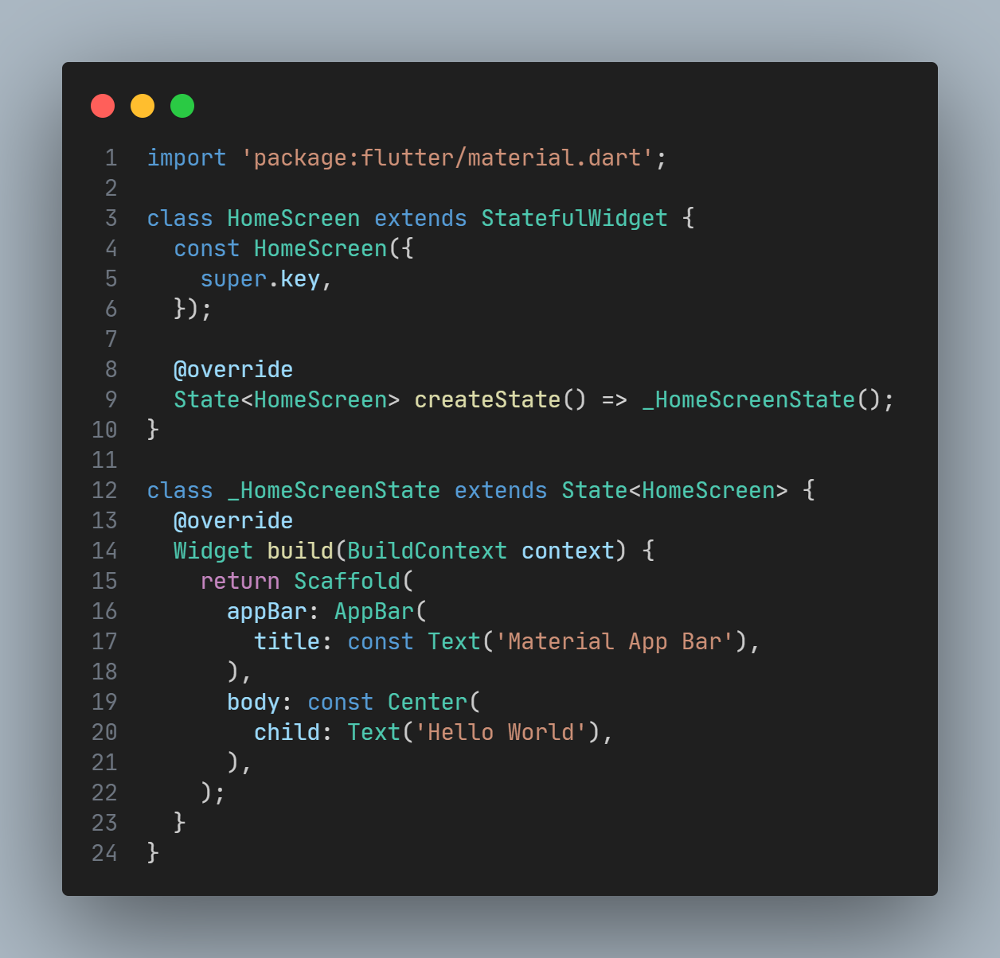
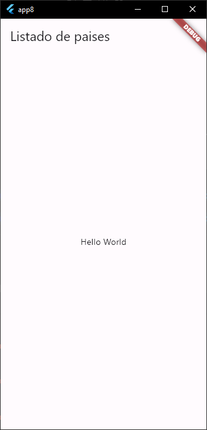
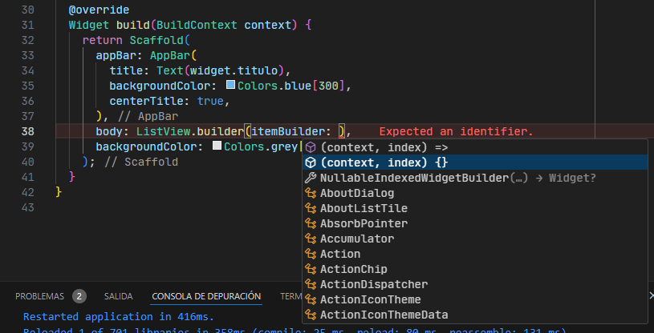

# app8

Un nuevo proyecto Flutter.

## Empezando

Este proyecto es un punto de partida para una aplicación Flutter.

Algunos recursos para ayudarte a comenzar si este es tu primer proyecto de Flutter:

- [Lab: Write your first Flutter app](https://docs.flutter.dev/get-started/codelab)
- [Cookbook: Useful Flutter samples](https://docs.flutter.dev/cookbook)

Para obtener ayuda para comenzar con el desarrollo de Flutter, consulte la
[online documentation](https://docs.flutter.dev/), que ofrece tutoriales,
muestras, orientación sobre desarrollo móvil y una referencia API completa.

# Vista previa de la app8

## Código de la primera pantalla

## Primera pantalla

## Código de la segunda pantalla

## Segunda pantalla

## Código de la tercera pantalla

## Tercera pantalla

## Código de la cuarta pantalla

## Cuarta pantalla

## Código de la quinta pantalla

## Quinta pantalla

## Código de la sexta pantalla

## Sexta pantalla

## Código de la septima pantalla

## Septima pantalla

## Código de la octava pantalla

## Octava pantalla

## Código de la novena pantalla

## Novena pantalla

